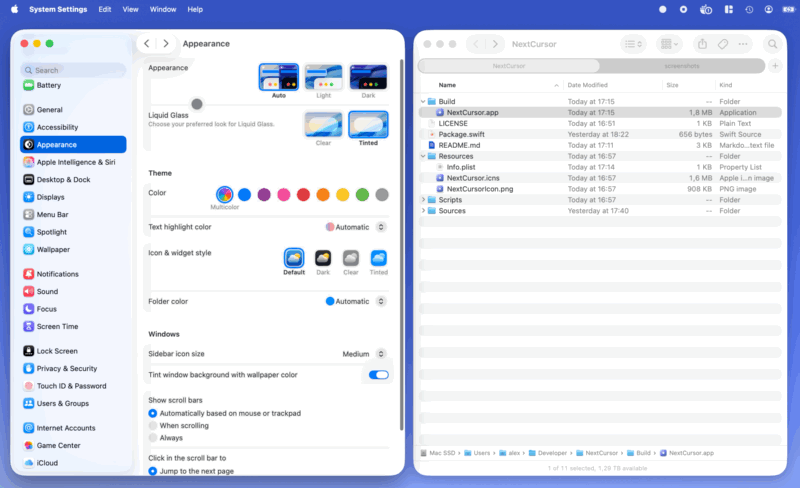

<p align="center">
  
</p>

<h1 align="center">NextCursor</h1>

<p align="center"><strong>Adaptive mouse cursor for the next generation.</strong></p>

<p align="center">
  NextCursor gives macOS an iPad-style pointer that snaps to controls, morphs to their shape, and becomes an I-beam over text.<br>
  Your real click position never moves.
</p>

<p align="center">
  <a href="Media/NextCursorDemo.mp4">
    
  </a>
</p>

<p align="center"><a href="Media/NextCursorDemo.mp4">Watch the full demo video</a></p>

## Highlights

- Magnetic snapping and smooth shape morphing
- Text cursor, click animation, and automatic fading
- Optional pointer inertia, disabled by default
- Multi-display, Spaces, full-screen, and full-display recording support
- Safe cursor restoration on quit, lock, or display sleep

## Download and run

[**Download NextCursor v0.1.15 for Apple Silicon →**](https://github.com/alexcybernetic/NextCursor/releases/download/v0.1.15/NextCursor-v0.1.15-macOS-arm64.zip)

Requires **macOS 13 or newer**. Unzip the download, place `NextCursor.app` where you want to keep it, and open it.

Grant access in **System Settings → Privacy & Security → Accessibility**. Add that exact app copy if it is not listed.

### If macOS blocks the app

In Finder, **Control-click (⌃-click)** or right-click `NextCursor.app`, choose **Open**, then confirm **Open**.

If it is still blocked, try opening it once, then go to **System Settings → Privacy & Security**, scroll to **Security**, and click **Open Anyway**.

## Build from source

Building requires Xcode Command Line Tools:

```sh
git clone https://github.com/alexcybernetic/NextCursor.git
cd NextCursor
./Scripts/build-app.sh
open Build/NextCursor.app
```

## Use

Opening NextCursor enables it. Use the menu-bar icon to toggle **Pointer Inertia** or choose **Restore System Cursor and Quit**.

Emergency toggle: **Control–Option–Command–P**

## Privacy and limitations

NextCursor works locally with no network access, analytics, or screen capture. It reads only Accessibility structure for the control beneath the pointer and never performs UI actions.

Snapping depends on each app exposing its controls through Accessibility. Games and custom canvas interfaces may remain circular.

## License

[MIT](LICENSE)
